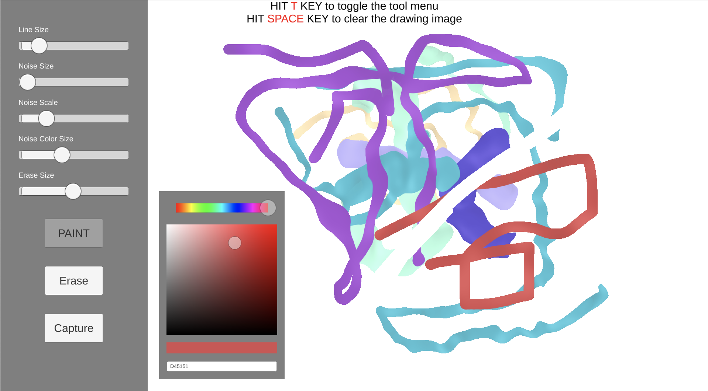

# UnityShaderPaint2
<b>UnityShaderPaint2 is the prototype shader-based paint tool app. It's a very experimental project.</b>  

 
 
・The paint brush feature supports only 2d Noise and a circle brush. 
・The 2d Noise brush uses the shader to draw. 
・There is no alpha setting feature for the drawing line.  
・The erase feature does not use the shader to erase the drawing image. It uses the Texture2d. 
・The color picker component implemented it from scratch. It is not the component from the assetstore. If you want to use the color picker only, you can grab them from this project. 
・The resolution only supports full HD, which is 1920 x 1080. 
 
This project only tested on mac os with an Intel CPU. 
There is some issue with the Graphic Blit on an Android device. It will pop up some glitch issues. So the Android won't work ATM. 
 
Unity Editor version: 2021.3.3f1
